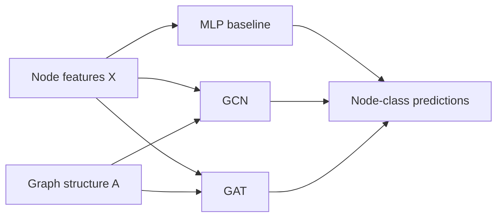

# GNN from Scratch

[](https://github.com/brunacg/gnn-from-scratch/actions/workflows/tests.yml)
[](https://www.python.org/)
[](LICENSE)

A compact educational implementation of **Graph Neural Networks from first principles**.
The neural-network and reverse-mode autodiff components are written with NumPy; SciPy is
used only for sparse graph storage and sparse matrix multiplication. There is no PyTorch
or TensorFlow autograd and no pre-built GCN/GAT layer.

The repository builds a small stack from the ground up:

- reverse-mode automatic differentiation;
- graph data structures and classic graph algorithms;
- a feature-only MLP baseline;
- Graph Convolutional Networks (GCN);
- multi-head Graph Attention Networks (GAT);
- training with Adam/AdamW, gradient clipping, early stopping, and checkpointing;
- reproducible experiments on the Cora citation network;
- unit tests for gradients, layers, models, graph algorithms, and sparse operations.

> **Goal:** make the mechanics behind message passing, graph convolution, attention,
> and gradient flow inspectable rather than hidden behind a deep-learning framework.

## Why this repository exists

High-level GNN libraries are excellent for research and production, but they can hide the
operations that make graph learning work. This project asks a simpler question:

> **What is a GCN or GAT actually doing under the hood?**

The code follows the computation from adjacency normalization and neighborhood
aggregation all the way to loss gradients and parameter updates. It also preserves the
debugging history of several non-obvious implementation failures, including a detached
autograd graph in GAT and dense attention paths that caused out-of-memory errors.

## Models



### MLP

A two-layer feature-only baseline. It never sees the adjacency matrix and therefore
provides a useful reference for measuring the contribution of graph structure.

### GCN

Implements the Kipf-Welling style update

\[
H^{(l+1)} = \sigma\left(\hat{A} H^{(l)} W^{(l)}\right),
\qquad
\hat{A}=\tilde{D}^{-1/2}(A+I)\tilde{D}^{-1/2}.
\]

The fixed adjacency multiplication is routed through a custom differentiable sparse
operation so gradients propagate through the node representations without treating the
adjacency matrix as trainable.

### GAT

Implements multi-head graph attention. For an edge \((i,j)\):

\[
e_{ij}=\mathrm{LeakyReLU}\left(a_l^T(Wh_i)+a_r^T(Wh_j)\right),
\]

followed by a neighborhood-wise softmax and weighted aggregation. The current
implementation works directly on the edge list of \(A+I\) and does **not** materialize a
dense \(N\times N\) attention matrix.

## Benchmark snapshot

Three seeds on Cora, maximum 200 epochs, early stopping with `patience=20`, and
gradient clipping at `5.0`:

| Model | Test accuracy (mean ± SD) | Mean best epoch | Mean trial time* |
|---|---:|---:|---:|
| MLP | 52.00 ± 0.54% | 28.0 | 4.6 s |
| GCN | 78.30 ± 0.24% | 46.3 | 10.5 s |
| GAT | 80.93 ± 1.86% | 26.7 | 20.7 s |

\*Timing is machine-dependent. See [docs/benchmarks.md](docs/benchmarks.md) for the
exact benchmark command and interpretation.

## Project structure

```text
gnn-from-scratch/
├── gnn/
│   ├── autograd/          # Tensor + reverse-mode autodiff operations
│   ├── data/              # Cora loading and preprocessing
│   ├── graph/             # Graph representation + BFS/DFS/Dijkstra/statistics
│   ├── layers/            # GCNLayer, GATLayer, MultiHeadGATLayer
│   ├── models/            # MLP, GCN, GAT
│   └── train.py           # optimizer, training, evaluation, checkpoints
├── scripts/
│   ├── train_cora.py      # train one model from the CLI
│   └── benchmark.py       # multi-seed model comparison
├── notebooks/
│   ├── 01_autograd.ipynb
│   ├── 02_graph_theory.ipynb
│   └── 03_gcn_full.ipynb
├── configs/
│   ├── cora_gcn.yaml
│   └── cora_gat.yaml
├── tests/                 # 88 unit/regression tests in the current snapshot
├── docs/
│   ├── overview.md
│   ├── benchmarks.md
│   └── postmortems/
├── pyproject.toml
└── CITATION.cff
```

## Quick start

### 1. Create an environment

```bash
python -m venv .venv
```

Activate it using the command for your operating system, then install the project:

```bash
python -m pip install --upgrade pip
python -m pip install -e ".[dev,notebooks]"
```

For a simple all-in-one dependency install, you can also use:

```bash
python -m pip install -r requirements.txt
```

### 2. Train a model

```bash
# GCN (default)
python scripts/train_cora.py

# GAT
python scripts/train_cora.py --model gat

# Feature-only MLP baseline
python scripts/train_cora.py --model mlp
```

Cora is downloaded on first use and cached under `~/.cache/gnn_scratch/`. Set the
`GNN_DATA_DIR` environment variable or pass `--data-dir` to use another location.

### 3. Use a configuration file

```bash
python scripts/train_cora.py --config configs/cora_gcn.yaml
python scripts/train_cora.py --config configs/cora_gat.yaml
```

### 4. Run the multi-seed benchmark

```bash
python scripts/benchmark.py \
  --trials 3 \
  --epochs 200 \
  --patience 20 \
  --grad-clip 5.0
```

### 5. Run the tests

```bash
python -m pytest -q
```

The test suite includes finite-difference gradient checks, graph-algorithm tests,
layer/model tests, sparse-vs-dense equivalence checks, and a regression test for the GAT
gradient-flow bug documented in the postmortem.

## Autograd engine

`gnn/autograd/tensor.py` implements a small reverse-mode autodiff engine. Each `Tensor`
stores its parents and a local backward closure; `Tensor.backward()` topologically sorts
the computation graph and accumulates gradients in reverse order.

Implemented differentiable operations include:

- matrix multiplication;
- broadcasting-aware addition;
- scalar multiplication;
- ReLU, LeakyReLU, and ELU;
- log-softmax and negative log-likelihood;
- concatenation and transpose;
- differentiable dropout;
- fixed dense and fixed sparse matrix multiplication.

The central rule is simple: **an operation that transforms a differentiable `Tensor`
must remain part of the computation graph**. The GAT postmortem shows how re-wrapping
`H.data` into a fresh tensor silently severed that graph and prevented the first layer
from learning.

## Sparse graph computation

The repository started with dense graph operations because they are easy to inspect, but
Cora is highly sparse. The current code keeps the educational implementation while
avoiding wasteful dense graph aggregation:

- **GCN:** cached CSR sparse-times-dense multiplication for `A_hat @ H`;
- **GAT:** edge-index attention, source-wise edge softmax, and sparse aggregation.

The sparse and dense formulations are checked for numerical equivalence in the test
suite.

## Notebooks

The notebooks are intended as guided companions to the source code:

1. **`01_autograd.ipynb`** — reverse-mode autodiff and gradient checks;
2. **`02_graph_theory.ipynb`** — adjacency matrices, Laplacians, and graph intuition;
3. **`03_gcn_full.ipynb`** — end-to-end experiments on Cora.

For a concise conceptual tour of the repository, see
[docs/overview.md](docs/overview.md).

## Debugging postmortems

One of the most useful parts of this project is the record of what went wrong and why:

- [GCN: dense aggregation and sparse rewrite](docs/postmortems/gcn.md)
- [GAT: detached gradients, OOMs, and sparse attention](docs/postmortems/gat.md)
- [MLP: baseline audit and cleanup](docs/postmortems/mlp.md)

These documents are intentionally detailed: they show how correctness, memory behavior,
and computational complexity interact in a low-level implementation.

## Scope and limitations

This is an **educational implementation**, not a replacement for PyTorch Geometric,
DGL, JAX, or production-grade autodiff frameworks.

Important limitations include:

- NumPy-based autodiff is intentionally minimal;
- only a small set of neural-network operations is implemented;
- experiments focus on a single citation-network benchmark;
- the implementation prioritizes clarity and inspectability over framework-level speed;
- benchmark timing varies across machines and Python/BLAS environments.

## References

- Kipf, T. N., & Welling, M. (2017). *Semi-Supervised Classification with Graph
  Convolutional Networks*. ICLR.
- Veličković, P. et al. (2018). *Graph Attention Networks*. ICLR.
- McCallum, A. et al. (2000). *Automating the Construction of Internet Portals with
  Machine Learning*. Information Retrieval, 3(2), 127–163.

## Citation

Citation metadata is available in [`CITATION.cff`](CITATION.cff). GitHub will expose it
through the repository's **Cite this repository** interface.

## License

Released under the [MIT License](LICENSE).
